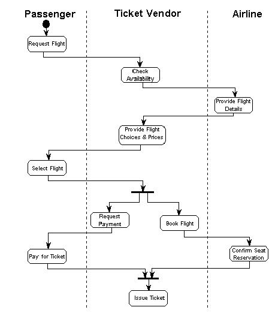
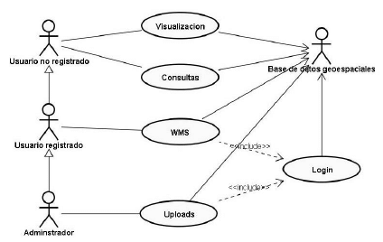
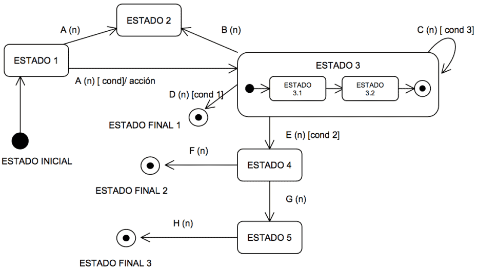
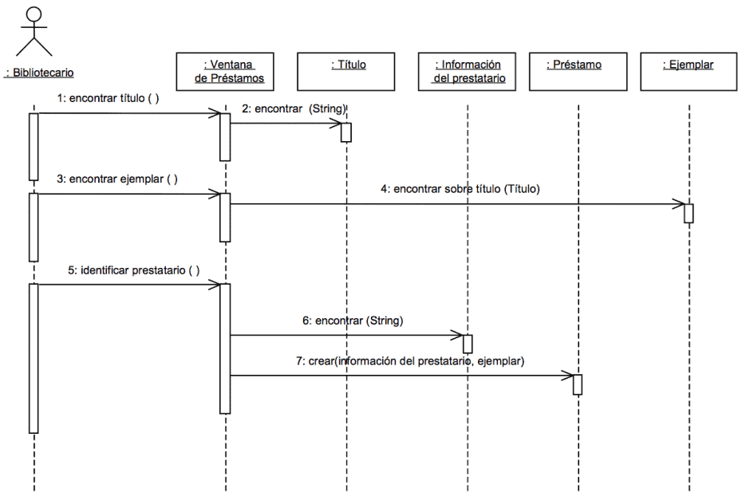
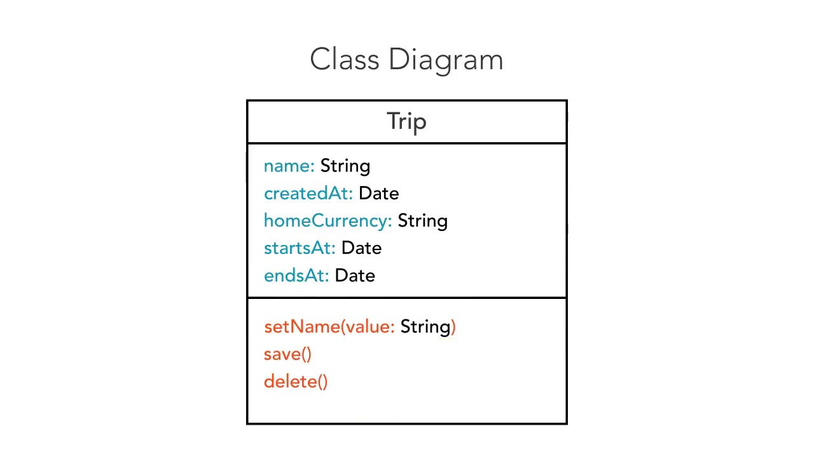
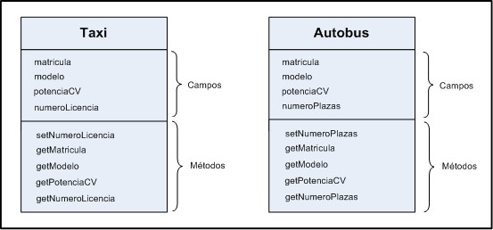

[Volver al indice](../README.md)

# Fundamentos

# Historia UML

- Los desarrolladores querian crear una semantica y notacion que se pudiera adecuar a todas las escalas de complejidad en diversos dominios
- No se tenia estandarizado los distintos puntos fuertes de OO
- Metodos principales : Booch, OMT, OOSE
- Orden cronologico: BOOCH, OMT UMV, UML 0.9, UML 1.0, UML 1.1

# Diagramas UML 2.5

- Diagrama de estructura
    1. Diagrama de clases
    2. Diagrama de componentes 
    3. Diagrama de objetos
    4. Diagrama de estructura compuesta    
    5. Diagrama de despliegue
    6. Diagrama de paquetes

- Diagrama de comportamiento
    1. Diagrama de casos de uso
    2. Diagrama de Maquina de estado
    3. Diagrama de actividad
    4. Diagrama de interaccion
        - Diagrama de secuencia
        - Diagrama de global de interaccion
        - Diagrama de comunicacion
        - Diagrama de tiempos

# Diagrama de estructura

- Diagrama de clases 
- Diagrama de objetos
- Diagrama de paquetes

El diagrama de clases es la construccion principal de cualquier solucion orientada a objetos. incluye el conjunto de clases que van a conformar el esqueleto del sistema, donde se define sus atributos y operaciones, a su vez las relaciones que tienen entre esas clases para de esa manera poder vertebrar la especificacion de los datos.

**CLASE = (Nombre) + (Atributos) + (Metodos)**

Cuando hay muchas clases, se pueden agrupar en diferentes diagramas de clases para ordernarlo. Las relaciones entre las clases se pueden realizar por diferentes tipos de flechas.


# Diagramas de comportamiento

- **Diagrama de comportamiento:** Muestra como el sistema responde a peticiones o evoluciona con el tiempo
    1. **Diagrama de actividades :** Muestra el flujo de actividades dentro del sistema. Similares a los organigrama, muestran el flujo de datos y de control. flujo de trabajo de los objetos que cooperan entre si.

    

    2. **Diagrama de casos de uso:** Se especifica para especificar requisistos, los elementos a usar son, casos de uso, actores y sus relaciones. describen las acciones que caracterizan el escenario de la aplicacion.

    

    3. **Diagrama de estados** : Representan del comportamiento de la aplicaciones, como cambian los estados y los eventos dentro de la plataforma. muestra el ciclo de vida de un objeto en particular, los estados se pueden encontrar y se define como se transita de uno a otro. muestran los estados y como los estados pueden cambiar a partir de un evento.

    

- **Diagrama de interaccion**: Engloba a diagramas de comportamiento que muestra el intercambio de mensajes, de un grupo de objetos que copeeran (colaboracion para un objetivo)

    1. **Diagrama de secuencias: ** Diagramas de interaccion, se resalta la ordenacion temporal de mensajes, muestran como los objetos se intercambian mensajes a lo largo del tiempo. 

    

# Clasificadores y atributos




**Clasificador:** es una descripcion de un conjunto de objetos con los mismos atributos, operaciones, relaciones y semantica. Tienen caracteristicas, y comportamientos, las clases son el tipo fundamental de clasificadores.

**Propíedades de un clasificador :**
    - *Atributos* : puede ser simple o complejo, confirma un espacio de nombre para sus atributos, dichos atributos no pueden ser modificados por otros objetos.
    - Operaciones
    - Caracteristicas avanzadas: permiten precisar mas los detalles propios de los clasificadores
        1. visibilidad
        2. alcance
        3. Multiplicidad
        4. Elementos abstractos, raices, hojas y polimorficos

```
<<esteriotipo>> visibilidad nombre : tipo [multiplicidad] = valor_inicial {propiedades}

nombre : nombre del atributo
tipo: tipo del atributo
valor_inicial: valor inicial o por defecto
propiedades: tipo de propiedad.
```

```
origen
tamaño:Area=(100,100)
visibilidad:Boolean=invisble
idUnico: Long
colores:Saturacion[3]
```

# Operaciones

Se utilizan para indicar las opreaciones de un clasificador, las declaraciones de operacion son heredadas por los descendientes del clasificador. 

- Operacion : la especificacion de una transformacion o consulta que puede tener un objeto
- Metodo : La implementacion de una operacion

```
<<estereotipo>> visibilidad nombre (lista de parametros) : tipo_retonos {propiedades}

mostrar()
+mostrar():Localizacion
```

+*oculta()* metodo abstracto

```
set(n:Nombre, s:String)
obtenerId():Integer
reiniciar(){guarded}
```

<u>control()</u> se debe tener en cuenta que si esta operacion estara presente en todas las instancias heredadas se debe poner subrayado

Existen dos operaciones

- Operaciones de cambio de estado: cambia el valor de algun atributo
- Operaciones de consulta: consulta informacion de los atributos



# Visibilidad

- **public (+)** : pueden ser accesibles por cualquier objeto externo
- **protected (#)** : solo sera posible acceder en el habito de la jeraquia de especializacion (herencia)
- **private (-)** : no hay posibilidad de acceder des un objeto externo, solo desde el mismo clasificador
- **package(~)** : visibilidad va estar en el ambito de contendor en el conjunto de recursos. 

Lo habitual es:

1. **Atributos**: privados
2. **Operaciones**: publicas

los atributos no se podran acceder externamente, pero por medio de las operaciones se modificaran estos atributos, pero las operaciones seran publicas por que deben poderse llamar externamente. aunque se debe tener en cuenta que algunas operaciones seran de uso privado o restringido para unos usuarios con permisos.